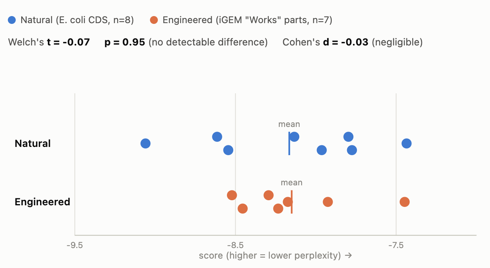

# Biosecurity Research - Sequence Perplexity Project

---

**Can the Bio model give low likelihood scores of sequence relevance to the training composition?**

If gene sequence has LOW NATURAL PLAUSABILTY but HIGH FUNCTIONALITY, then it could be ```engineered``` (and potentially harmful). 

> Themes: Biosecurity risk; AI safety

---

# Results

**Final pilot scores: engineered vs. natural sequences**
Model: Nucleotide Transformer



**Explaining the graph:** the x-axis is likelihood score returned by ```Nucleotide Transformer``` for a given sequence. y-axis defines the category natural vs engineered.

**Expectation:** 
- Natural sequences get scored lower (LOW PERPLEXITY TO MODEL) and engineered sequences get scored higher 
- Get a separation or distinction between engineered vs natural sequences

**Observation:** the group means are nearly identical (-8.17 vs -8.15) and Welch's t-test shows no detectable difference (p=0.95, Cohen's d=-0.03)

**Inference:** 
- too small to conclude a true null effect with confidence
- pipeline itself is sound for run
- more data is required for substantial comparson and statistical assesment


Read notes.md for more info
